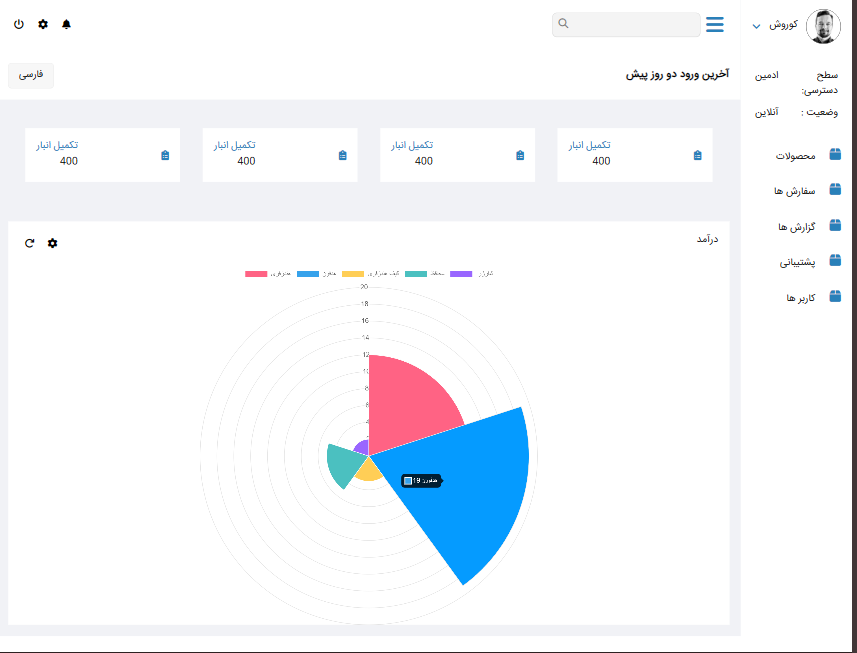

# Panel

[](LICENSE)
[](https://github.com/sajjad-sisakhtpour/panel/stargazers)
[](https://github.com/sajjad-sisakhtpour/panel/network/members)
[](https://github.com/sajjad-sisakhtpour/panel)

## Overview
**Panel** is a customizable, responsive dashboard template designed to manage user profiles, access control, product and order management, and data visualization in an admin panel layout. Created as a showcase project, it aims to serve as a comprehensive example of modern front-end development practices.

## Prerequisites
- HTML5, CSS3, JavaScript basics
- [Node.js](https://nodejs.org/) (for local setup if required)
- [Chart.js](https://www.chartjs.org/) (for data visualization)

## Installation
1. Clone the repository:
    ```bash
    git clone https://github.com/sajjad-sisakhtpour/panel.git
    ```
2. Navigate to the project directory:
    ```bash
    cd panel
    ```
3. Open `index.html` in a browser or use a live server (e.g., `Live Server` extension for Visual Studio Code).

## Usage
1. Load the project in your browser or a live development environment.
2. Use the sidebar navigation to interact with various dashboard sections.
3. Customize user profile information, access settings, and visualize data using the provided Chart.js setup.

## Examples
### Accessing the Dashboard
The sidebar includes multiple sections, including Products, Orders, Reports, Support, and Users, each represented by FontAwesome icons for easy navigation.

### Data Visualization
The project utilizes **Chart.js** to display data in a visually appealing chart. This can be customized in the `panel.js` file.

## Screenshots


## Documentation
This project uses the following main files:
- `index.html` - The main HTML file, setting up the dashboard structure.
- `panel.css` - Styles the layout, sidebar, and dashboard elements.
- `panel.js` - Controls the interactivity and dynamic features like chart updates.

## Contributing
1. Fork the repository on GitHub.
2. Create a new branch (`git checkout -b feature/YourFeature`).
3. Commit your changes (`git commit -m 'Add a new feature'`).
4. Push to the branch (`git push origin feature/YourFeature`).
5. Create a new Pull Request.

## License
This project is licensed under the MIT License. See the [LICENSE](LICENSE) file for details.

## Contact
For further information or collaboration, please reach out:
- **GitHub**: [sajjad-sisakhtpour](https://github.com/sajjad-sisakhtpour)
- **LinkedIn**: [sajad-sisakht-pour](https://ir.linkedin.com/in/sajad-sisakht-pour)
- **Email**: [sajjad.sisakhtpour@gmail.com](mailto:sajjad.sisakhtpour@gmail.com)

## Live Demo
To see the dashboard live in action, [click here](https://github.com/sajjad-sisakhtpour/panel).